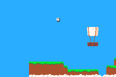
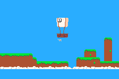

# Readme / Log

Follow along with me as I attempt to build a platformer thing maybe..

So yeah, pull up a seat and enjoy the journey.

## Tomorrow..

+ Refactor and make a player class
+ Improve collisions

## Day 13

Collisions.

This should be fun.

FYI I first learned collision logic making a similar platformer in pico8. I found these tutorials invaluable for that. And tbh its a great resource that can bbe applied in any programming language even though the examples are lua & pico8.

This should be easy now that we can get map data.

So first off I am making a simple method to apply gravity so that we can move better.

``` c++
    bn::fixed_point apply_gravity(bn::fixed_point pos)
    {
        return bn::fixed_point(pos.x(), pos.y() +1);
    }
```

And I call it like this...

``` c++
cat_sprite.set_position(apply_gravity(cat_sprite.position()));
```

It takes a position and adds 1 to the y value. Yes positive y is down, I am slowly getting used to it too.

Now we fall :D



Good start. Now to stop us falling when we hit the ground. Note that for now I am not bothering too much about the sprites exact position. You will see what I mean.

The next function we make is one to check for collisions and stop the falling.

``` c++
    void check_collisions(bn::sprite_ptr& sprite, bn::affine_bg_ptr& map)
    {
        // gets the current map cell the sprite is on.
        bn::fixed current_cell = get_map_index(sprite.x(), sprite.y(), map.dimensions().width());

        // at the moment all I am doing is checking if the cell is not the sky cell (aka not zero)
        bool is_hit = map.map().cells_ref().value().at(current_cell.integer()) != 0;
        
        if(is_hit){
            // if it is hit then we undo gravity :D
            sprite.set_y(sprite.y() -1);
        }
    }
```


Things to note... 

+ We are checking exactly where the centre of our sprite is, but we can change this to the bottom of our sprite fairly easily.
+ We are just checking that the cell isn't sky, somehow we need to know what tiles we can stand on and what we can't.

Being able to tell different tiles apart is hard though. Their index is determined by the image processor that creates the tiles and the map from our bmp. What I did notice though is that it kind of looks like the following...

```
00 00 00 00 00 00 00 00 00 00 00 00 00 00 00 00 00
00 00 00 00 00 00 00 00 00 00 00 00 00 00 00 00 00
00 00 00 01 02 03 00 00 00 00 00 00 00 00 00 00 00
00 00 00 04 05 06 00 00 00 00 00 00 00 00 00 00 00
00 00 00 00 00 00 00 00 00 00 00 00 00 00 00 00 00
00 00 00 00 00 00 00 00 00 00 00 00 00 00 00 00 00
07 08 08 07 09 10 00 00 00 00 00 00 00 00 00 00 00
11 11 11 11 11 11 07 08 07 08 07 08 07 08 08 07 09
11 11 12 11 11 11 11 11 12 11 11 11 11 11 11 12 12
```

So the tiles position in the tile array is determined by the order it appears in the map.

And since I don't plan on using the top of the map anyway, prehaps I can throw all the floor tiles into the first row. Like this...


```
00 01 02 03 04 05 06 07 00 00 00 00 00 00 00 00 00
00 00 00 00 00 00 00 00 00 00 00 00 00 00 00 00 00
00 00 00 08 09 10 00 00 00 00 00 00 00 00 00 00 00
00 00 00 11 12 13 00 00 00 00 00 00 00 00 00 00 00
00 00 00 00 00 00 00 00 00 00 00 00 00 00 00 00 00
00 00 00 00 00 00 00 00 00 00 00 00 00 00 00 00 00
01 02 01 03 04 05 00 00 00 00 00 00 00 00 00 00 00
14 14 14 14 14 14 07 04 07 02 07 01 07 01 02 07 03
14 14 15 14 14 14 14 14 12 14 14 14 14 14 14 15 14
```

Now my collision check could can just confirm if the tile is between 0 and 8, if it is then it is ground.

I mean, this should work. At least until it becomes complex enough to have different types of collisions and such.

I will mull on this for a little while haha.

### Interlude

In the meantime I got inspired by someone making chiptunes for their game and decided to do the same.

I downloaded MilkyTracker, which at first was really confusing, but [this youtuber](https://www.youtube.com/channel/UCegheZHIpMbFwxbY4jrc8DA/videos) has tons of awesome tutorials on it.

With a little effort we have some background music playing. 

``` c++
// music item import for .mod .xm .it and .s3m
#include "bn_music_items.h"

// to play your song on repeat at 50% volume
bn::bn_music_items::my_song.play(0.5);
```

NOTE: You can use sound_items in the same way for .wav files.

Probably a little too cyberpunk for the current game, but it was fun to make anyway.

You can listen to it [here](readme-images/example.wav).

## Day 12

Okay. I did it!

I figured out how to get map data so I can start using tile data to figure out collisions.

So as before. We have our bg that we made..

`bn::affine_bg_ptr map_bg = bn::affine_bg_items::map.create_bg(256, 256);`

And I finally found out that you can call `map_bg.map().cells_ref()` to get the pointer to the cells of the map. You can then call `.value()` on it to get the actual data in a [span](https://gvaliente.github.io/butano/classbn_1_1span.html) (kind of like an array?).

So we can use `map_bg.map().cells_ref().value()` to get the cells and `at(x)` to get the cell at x. The map cells are a 1d array organised like this...

```
1 2 3
4 5 6
7 8 9
```

So I made a helper method to get the cell number of an x and y co-ord. Which ends up being something like this..

```c++
bn::fixed get_map_index(bn::fixed tile_x, bn::fixed tile_y, bn::fixed columns)
{
    return (tile_y * columns) + tile_x;
}
```

IMPORTANT NOTE : My actual code is not this pretty.

So now I am just logging the tile at my sprites co-ordinates, which works surprisingly well considering it isn't optimized at all and I have no idea what I am doing.

This will be the basis of collisions and I have a little hacky plan for making it easier for myself, but I will share it later.

I also took the time to add some text to show the current tile my player is over. The [examples](https://gvaliente.github.io/butano/examples.html) are really good for this.

For this I needed all of these..

``` c++
#include "bn_string_view.h"
#include "bn_vector.h"
#include "bn_sprite_text_generator.h"
```

Plus the sprite font from the example... `variable_8x16_sprite_font`

And then the following..

``` c++
// make a text generator using the font supplied, you can use your own images for your own font if you want
bn::sprite_text_generator text_generator(variable_8x16_sprite_font);

// sets the text horizontally in the centre
text_generator.set_center_alignment();

// make a vector to store pointers to the sprites we are using
bn::vector<bn::sprite_ptr, 32> text_sprites;

// and then in our loop..

while (true)
{
    // clear the previous frames text
    text_sprites.clear();

    // generate the new text
    text_generator.generate(0, -40, currentCell, text_sprites);

    bn::core::update();
}

```

Pretty happy with what I have acheived today. Can rest easy tonight.



Oh. Also todays tag -> [day-12](https://github.com/foopod/gbaGamejam2021/releases/tag/day-12)

OMG. Almost forgot the most important thing. I learned how to cast integers to strings.

``` c++
bn::to_string<32>(my_integer);
```

And tonight I have homework reading the following about pointers...

+ https://www.geeksforgeeks.org/auto_ptr-unique_ptr-shared_ptr-weak_ptr-2/
+ https://docs.microsoft.com/en-us/cpp/cpp/how-to-create-and-use-shared-ptr-instances?view=msvc-160


## Days 4-11

Okay. So I may have been scared off a little by C++ again and a little frustrated at my self for not trying harding or digging deeper.

This week hasn't been very good.

But that isn't to say I haven't done anything. The [gbaDev discord](https://discord.io/gbadev) is buzzing with activity and I am enjoying learning little bits and pieces about the GBA, dev tools and other random projects people are working on.

I also watched exelotl's awesome talk on programming for GBA with nim which was super interesting, especially seeing what they are doing with h-blank effects on their project. Link [here](https://www.youtube.com/watch?v=sZUM7MhWr88).

Reading [libtonc](https://www.coranac.com/tonc/text/toc.htm) in my spare time and random things I have found in the [gbadev resources page](https://gbadev.net/).

BUT JONO! DID YOU DO ANY PROGRAMMING?!?!

Well. Yes.

I made the sprite flip when you turn in the other direction. This was super easy in Butano.

``` c++
// when moving right
cat_sprite.set_horizontal_flip(false);

// when moving left
cat_sprite.set_horizontal_flip(true);
```

See the awful state of the code and this point with the tag [day-11](https://github.com/foopod/gbaGamejam2021/releases/tag/day-11) and ignore the folder labelled wip.


## Day 3

### Animation

Today I am tackling animation, not for any specific purpose, but just because I have the assets for them already.

We can use Butano's `create_sprite_animate_action_forever` to kick off the animation. 

> Also just note that throughout using Butano you will see the use of Actions, they allow you to do transformations to a sprite over time. Read more [here](https://gvaliente.github.io/butano/group__action.html).

So getting the animation working is pretty simple...

``` c++
#include "bn_sprite_animate_actions.h"

bn::sprite_animate_action<9> action = bn::create_sprite_animate_action_forever(
                    cat_sprite, 6, bn::sprite_items::cat.tiles_item(), 1, 2, 3, 4, 5, 6, 7, 8, 9);
```

Here I am using my cat sprite...


So we can call `bn::create_sprite_animate_action_forever` and pass in the `cat_sprite` sprite, the `6` delay between frames, the `bn::sprite_items::cat.tiles_item()` tiles item and a `1, 2, 3, 4..` list of frames to use.

Docs for this [here](https://gvaliente.github.io/butano/group__sprite.html#gadb2289e456a531a3450b5ba5936e0d23).

Note that my cat sprite has 10 frames, but the above code only uses 9 of them, we skip frame[0] because it is an idle frame and I just wanted to make the cat run.

So now we have the cutest running cat...


Let's keep going!

### Movement

The thing that immediately sprung to mind was "okay now we have to make it move".

So I had a quick look at the keypad example in Butano and made the following in my loop...

``` c++
#include "bn_keypad.h"

if(bn::keypad::left_held())
{
    cat_sprite.set_x(cat_sprite.x() - 1);
}
else if(bn::keypad::right_held())
{
    cat_sprite.set_x(cat_sprite.x() + 1);
}

if(bn::keypad::up_held())
{
    cat_sprite.set_y(cat_sprite.y() - 1);
}
else if(bn::keypad::down_held())
{
    cat_sprite.set_y(cat_sprite.y() + 1);
}
```

I am trying to add the header files that you need too, but the best way to use these examples is probably to look for the tag for today.. [day-3](https://github.com/foopod/gbaGamejam2021/releases/tag/day-3)

Yay! It moves!

### Background

Now to add a background image so our cat can explore something...

``` c++
#include "bn_affine_bg_ptr.h"
#include "bn_affine_bg_item.h"

#include "bn_affine_bg_items_map.h"

bn::affine_bg_ptr map_bg = bn::affine_bg_items::map.create_bg(0, 0);
```

Okay, so I don't know if it is working or not. I am guessing most of the image would be off the screen anyway because it is 512x512 but I only use a very small area of it.

Let's jump straight into the camera so we can move it around and find our background.

### Camera

So I just finished trying to implement it, but I still don't really know how it works. Let's go through this together!

I added the following...

``` c++
#include "bn_camera_actions.h"

bn::camera_ptr camera = bn::camera_ptr::create(0, 0);

while(true)
{
    if(bn::keypad::right_held())
    {
        cat_sprite.set_x(cat_sprite.x() + 1);
        camera.set_x(camera.x() + 1);
    }
    ...
    
    // Below is what confuses me, the docs say 'Sets the camera_ptr attached to this sprite', but why would we need it on the bg and the sprite? Because we do, it won't move otherwise. Any ideas?
    cat_sprite.set_camera(camera);
    map_bg.set_camera(camera);
}
```

This way, when the cat moves, then the camera follows.

Ah! There is my background.

### Logging

Okay I don't understand this co-ordinate system. Lets try to figure that out.

Luckily logging is pretty simple with Butano.. `BN_LOG("Hello World!");`

``` c++
#include "bn_log.h"
BN_LOG("sprite-x");
BN_LOG(cat_sprite.x());
BN_LOG("sprite-y");
BN_LOG(cat_sprite.y());

```

Have I figured out how to concatenate ints and strings in c++ yet? No! So lots of lines of logging it is.

If you are using mgba you can set the log level when you run by commandline. I use the following to build and launch my .gba at the same time.

`make -j4 && mgba feline.gba -l 4`

+ `-j4` is telling the compiler that I have 4 cores it can utilise 
+ `-l 4` sets mgba to log level 4 so that you can see the logging we added.

### Background Part 2

Okay, so now I can move the BG to the right place..

``` c++
bn::affine_bg_ptr map_bg = bn::affine_bg_items::map.create_bg(128, -176);
```

Looking good.


## Day 2

Okay lets do this. Lets try to get as far as I can doing this with assets from an old game.

This is the Butano Sprite Example..

``` c++
/*
 * Copyright (c) 2020-2021 Gustavo Valiente gustavo.valiente@protonmail.com
 * zlib License, see LICENSE file.
 */
void sprites_visibility_scene(bn::sprite_text_generator& text_generator)
    {
        constexpr const bn::string_view info_text_lines[] = {
            "A: hide/show sprite",
            "",
            "START: go to next scene",
        };

        info info("Sprites visibility", info_text_lines, text_generator);

        bn::sprite_ptr red_sprite = bn::sprite_items::red_sprite.create_sprite(0, 0);

        while(! bn::keypad::start_pressed())
        {
            if(bn::keypad::a_pressed())
            {
                red_sprite.set_visible(! red_sprite.visible());
            }

            info.update();
            bn::core::update();
        }
    }
```

But really the only thing we need is `bn::sprite_ptr red_sprite = bn::sprite_items::red_sprite.create_sprite(0, 0);`

Also have a look at [how to do imports](https://gvaliente.github.io/butano/import.html) to get your image files into Butano.

So lets draw something to the screen...


Check out the tag [day-2](https://github.com/foopod/gbaGamejam2021/releases/tag/day-2) on this repo to see the code in this state.


## Day 1

I normally use much higher level languages, python, javascript, c#. But looking at the example code for Butano and seeing all of these :: confuses me a lot.

Maybe I could map all of this to a language that I know. Googles "Lua bridge" furiously.

Eventually gives up.