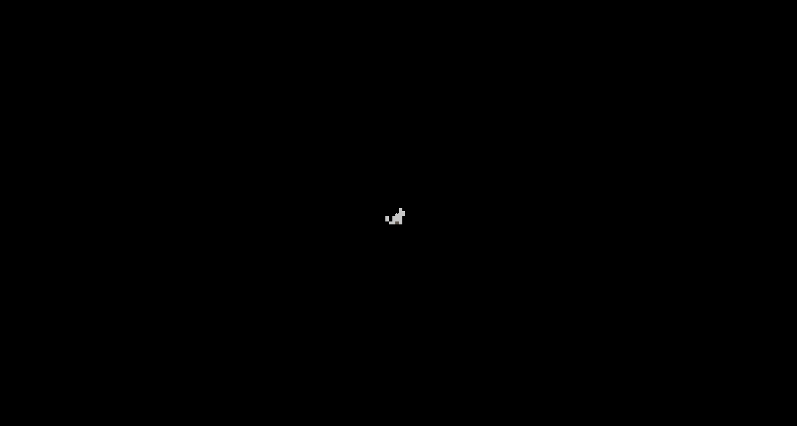
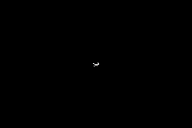
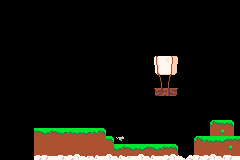

# Readme / Log

## Day -2

"Oh GBA Gamejam, that could be a lot of fun!" - me

## Day 1

I normally use much higher level languages, python, javascript, c#. But looking at the example code for Butano and seeing all of these :: confuses me a lot.

Maybe I could map all of this to a language that I know. Googles "Lua bridge" furiously.

Eventually gives up.

## Day 2

Okay lets do this. Lets try to get as far as I can doing this with assets from an old game.

This is the Butano Sprite Example..

``` c++
/*
 * Copyright (c) 2020-2021 Gustavo Valiente gustavo.valiente@protonmail.com
 * zlib License, see LICENSE file.
 */
void sprites_visibility_scene(bn::sprite_text_generator& text_generator)
    {
        constexpr const bn::string_view info_text_lines[] = {
            "A: hide/show sprite",
            "",
            "START: go to next scene",
        };

        info info("Sprites visibility", info_text_lines, text_generator);

        bn::sprite_ptr red_sprite = bn::sprite_items::red_sprite.create_sprite(0, 0);

        while(! bn::keypad::start_pressed())
        {
            if(bn::keypad::a_pressed())
            {
                red_sprite.set_visible(! red_sprite.visible());
            }

            info.update();
            bn::core::update();
        }
    }
```

But really the only thing we need is `bn::sprite_ptr red_sprite = bn::sprite_items::red_sprite.create_sprite(0, 0);`

Also have a look at [how to do imports](https://gvaliente.github.io/butano/import.html) to get your image files into Butano.

So lets draw something to the screen...



Check out the tag [day-2](https://github.com/foopod/gbaGamejam2021/releases/tag/day-2) on this repo to see the code in this state.

## Day 3

### Animation

Today I am tackling animation, not for any specific purpose, but just because I have the assets for them already.

We can use Butano's `create_sprite_animate_action_forever` to make kick off the animation. 

> Also just note that throughout using Butano you will see the use of Actions, they allow you to do transformations to a sprite over time. Read more [here](https://gvaliente.github.io/butano/group__action.html).

So getting the animation working is pretty simple...

``` c++
#include "bn_sprite_animate_actions.h"

bn::sprite_animate_action<9> action = bn::create_sprite_animate_action_forever(
                    cat_sprite, 6, bn::sprite_items::cat.tiles_item(), 1, 2, 3, 4, 5, 6, 7, 8, 9);
```

Here I am using my cat sprite...


So we can call `bn::create_sprite_animate_action_forever` and pass in the `cat_sprite` sprite, the `6` delay between frames, the `bn::sprite_items::cat.tiles_item()` tiles item and a `1, 2, 3, 4..` list of frames to use.

Docs for this [here](https://gvaliente.github.io/butano/group__sprite.html#gadb2289e456a531a3450b5ba5936e0d23).

Note that my cat sprite has 10 frames, but the above code only uses 9 of them, we skip frame[0] because it is an idle frame and I just wanted to make the cat run.

So now we have the cutest running cat...



Let's keep going!

### Movement

The thing that immediately sprung to mind was "okay now we have to make it move".

So I had a quick look at the keypad example in Butano and made the following in my loop...

``` c++
#include "bn_keypad.h"

if(bn::keypad::left_held())
{
    cat_sprite.set_x(cat_sprite.x() - 1);
}
else if(bn::keypad::right_held())
{
    cat_sprite.set_x(cat_sprite.x() + 1);
}

if(bn::keypad::up_held())
{
    cat_sprite.set_y(cat_sprite.y() - 1);
}
else if(bn::keypad::down_held())
{
    cat_sprite.set_y(cat_sprite.y() + 1);
}
```

I am trying to add the header files that you need too, but the best way to use these examples is probably to look for the tag for today.. [day-3](https://github.com/foopod/gbaGamejam2021/releases/tag/day-3)

Yay! It moves!

### Background

Now to add a background image so our cat can explore something...

``` c++
#include "bn_affine_bg_ptr.h"
#include "bn_affine_bg_item.h"

#include "bn_affine_bg_items_map.h"

bn::affine_bg_ptr map_bg = bn::affine_bg_items::map.create_bg(0, 0);
```

Okay, so I don't know if it is working or not. I am guessing most of the image would be off the screen anyway.

Let's jump straight into the camera so we can move it around and find our background.

### Camera

So I just finished trying to implement it, but I still don't really know how it works. Let's go through this together!

I added the following...

``` c++
#include "bn_camera_actions.h"

bn::camera_ptr camera = bn::camera_ptr::create(0, 0);

while(true)
{
    if(bn::keypad::right_held())
    {
        cat_sprite.set_x(cat_sprite.x() + 1);
        camera.set_x(camera.x() + 1);
    }
    ...
    
    // Below is what confuses me, the docs say 'Sets the camera_ptr attached to this sprite', but why would we need it on the bg and the sprite? Because we do, it won't move otherwise. Any ideas?
    cat_sprite.set_camera(camera);
    map_bg.set_camera(camera);
}
```

This way, when the cat moves, then the camera follows.

Ah! There is my background.

### Logging

Okay I don't understand this co-ordinate system. Lets try to figure that out.

Luckily logging is pretty simple with Butano..

``` c++
#include "bn_log.h"

BN_LOG("Hello World!");
```

Have I figured out how to concatenate ints and strings in c++ yet? No! So lots of lines of logging it is.

If you are using mgba you can set the log level when you run by commandline. I use the following to build and launch my .gba at the same time.

`make -j4 && mgba feline.gba -l 4`

+ `-j4` is telling the compiler that I have 4 cores it can utilise 
+ `-l 4` sets mgba to log level 4 so that you can see the logging we added.

### Background Part 2

Okay, so now I can move the BG to the right place..

``` c++
bn::affine_bg_ptr map_bg = bn::affine_bg_items::map.create_bg(128, -176);
```

Looking good.



## Days 4-11

Okay. So I may have been scared off a little by C++ again and a little frustrated at my self for not trying harding or digging deeper.

This week hasn't been very good.

But that isn't to say I haven't done anything. The [gbaDev discord](https://discord.io/gbadev) is buzzing with activity and I am enjoying learning little bits and pieces about the GBA, dev tools and other random projects people are working on.

I also watched exelotl's awesome talk on programming for GBA with nim which was super interesting, especially seeing what they are doing with h-blank effects on their project. Link [here](https://www.youtube.com/watch?v=sZUM7MhWr88).

Reading [libtonc](https://www.coranac.com/tonc/text/toc.htm) in my spare time and random things I have found in the [gbadev resources page](https://gbadev.net/).

BUT JONO! DID YOU DO ANY PROGRAMMING?!?!

Well. Yes.

I made the sprite flip when you turn in the other direction. This was super easy in Butano.

``` c++
// when moving right
cat_sprite.set_horizontal_flip(false);

// when moving left
cat_sprite.set_horizontal_flip(true);
```

See the awful state of the code and this point with the tag [day-11](https://github.com/foopod/gbaGamejam2021/releases/tag/day-3) and ignore the folder labelled wip.

## Do Tomorrow..

+ Figure out how to access map data on the fly